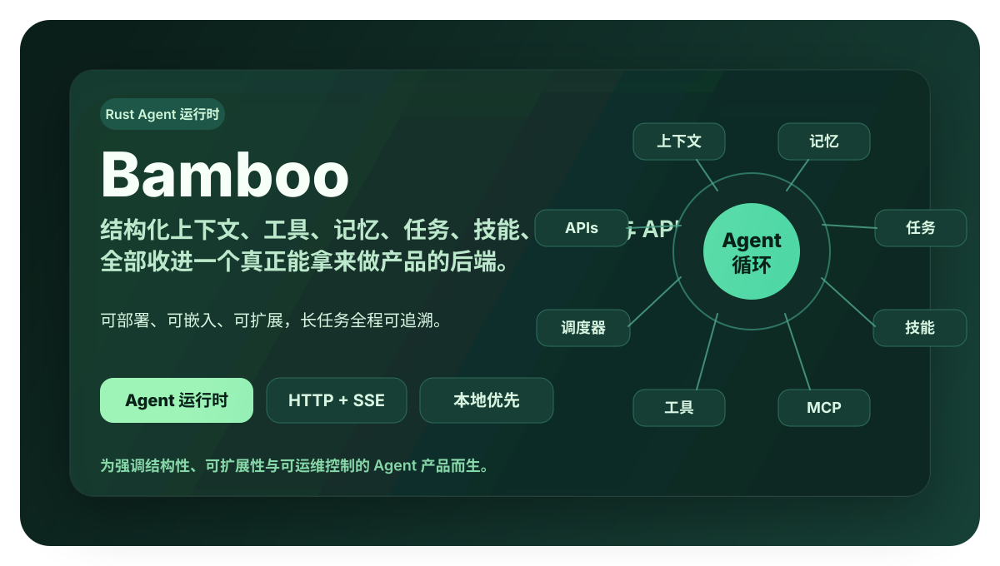
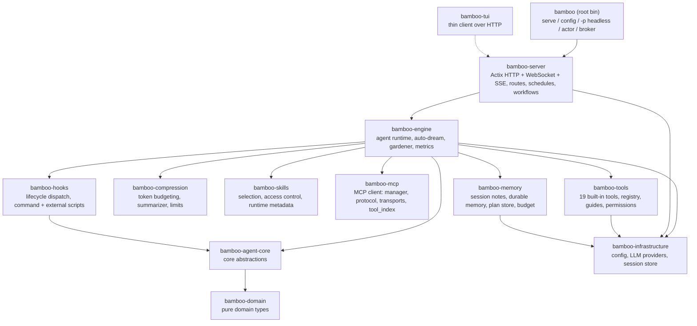

<div align="center">

# nana 🎋

> 本项目原名 **Bamboo**，现已更名为 **nana**。为保持与既有部署、数据目录（`/data`）、环境变量（`BAMBOO_*`）与 crate 名称的兼容，代码层面的 `bamboo` 标识保持不变，仅产品展示名改为 nana。



### 本地优先的 AI Agent 运行时，使用 Rust 编写。

**持久化记忆、19 个内置工具、skill、MCP、工作流与调度——全部通过 HTTP + WebSocket + SSE API 提供。**
既可以把它当作服务器运行，也可以把同一套 Agent 循环作为 Rust crate 嵌入使用。你的数据始终留在你自己的机器上。

[](https://crates.io/crates/bamboo-agent)
[](https://docs.rs/bamboo-agent)
[](https://github.com/bigduu/Bamboo-agent/actions/workflows/ci.yml)
[](./LICENSE)

</div>

---

## 这是什么

nana（原名 Bamboo）是运行在你自己机器上的 AI 助手"大脑"。它远不止聊天——它会记笔记、积累可检索的长期记忆、使用工具（读写文件、运行命令、搜索网络），并自动压缩超长对话，让助手永不"失忆"或陷入停顿。这一切都封装在一个紧凑、可自托管的程序里，数据默认留在本地。

**nana 就是驱动你所见 AI 产品的引擎。**

---

## 核心能力一览

| 能力 | 作用 |
|---|---|
| 🧠 **记忆系统** | 会话笔记、由 Jiandu 持有的派生 Dream 快照，以及跨会话的持久记忆，配合自动 Dream 与后台 Gardener 维护 |
| 🗜️ **上下文压缩** | 混合压缩：滚动摘要 + 最近窗口保留，自动裁剪超长工具输出，按模型上下文窗口预算执行 |
| 🛠️ **内置工具** | 19 个内置工具：文件、图像、搜索、Shell、Web 抓取、任务、权限请求等 |
| 🎯 **Skill** | 可选/可发现的 skill，基于请求提示做轻量选择，内置 docx / pdf / pptx / xlsx / skill-creator |
| 🔌 **MCP** | Model Context Protocol 客户端，可接入外部工具服务器 |
| ⏰ **工作流与调度** | 声明式工作流加载 + cron 风格的调度触发引擎 |
| 🌐 **HTTP / WebSocket / SSE** | Actix 服务器、REST API、共享 `/v2/stream` WebSocket、传统 SSE 事件流，以及 OpenAI / Anthropic / Gemini 兼容端点 |
| 🏗️ **多 provider** | anthropic（默认）、openai、gemini、copilot、bodhi 路由 |

---

## 架构

Bamboo 是一个 Cargo **workspace**：一个很薄的根二进制（`bamboo-agent`，提供 `bamboo` 命令）构建在按四层组织的多个职责单一的 crate 之上——`crates/core/`（类型 + 接口）、`crates/infra/`（独立服务）、`crates/engine/`（核心逻辑）、`crates/app/`（可执行程序 + 入口）。实际的服务器是 `crates/app/bamboo-server`（不存在重复的服务器目录树）。`bamboo-agent-core` **仅**依赖 `bamboo-domain`，保持核心抽象干净。



**Workspace 成员**（来自 `Cargo.toml`），按层组织：

- **`crates/core/`** — `bamboo-domain`（纯领域类型）、`bamboo-agent-core`（核心抽象）
- **`crates/infra/`** — `bamboo-config`、`bamboo-llm`、`bamboo-storage`、`bamboo-a2a`、`bamboo-infrastructure`、`bamboo-memory`、`bamboo-metrics`、`bamboo-notification`、`bamboo-skills`、`bamboo-mcp`、`bamboo-permission`、`bamboo-compression`、`bamboo-subagent`、`bamboo-hooks`、`bamboo-analytics`（仅开发用）
- **`crates/engine/`** — `bamboo-engine`、`bamboo-tools`
- **`crates/app/`** — `bamboo-server`、`bamboo-server-tools`、`bamboo-sdk`、`bamboo-tui`、`bamboo-client-core`、`bamboo-broker`

……外加根目录的 `bamboo-agent` 二进制。

**在 Zenith 技术栈中的位置：** Bodhi 是 Tauri 桌面外壳，它会启动或复用本地 `bamboo serve`，等待 `GET /api/v1/health`，并管理 sidecar 生命周期。Bamboo 现在默认嵌入经过校验的 Lotus Next 产物；在分阶段迁移期间，外壳仍可提供显式的外部前端包。Lotus Next 默认通过 HTTP 发送请求，并通过一条共享的 `/v2/stream` WebSocket 接收实时事件；当 v2 传输被显式禁用或其初始 WebSocket 连接无法建立时，传统的账户与 session SSE 事件流作为回退方案。Bamboo 仍然是执行引擎。`bodhi-server` 是独立、可选的托管账户与 provider 路径；本地 Bodhi → Bamboo → Lotus Next 路径并不需要它。

---

## 特色深度解析

### 记忆系统 · 通过 `crates/infra/bamboo-memory` 接入 Jiandu

Bamboo 不维护第二套记忆实现。它职责单一的 `bamboo-memory` 门面把权威持久化、确定性词法检索、会话笔记和 Dream 快照全部委托给确切的 `jiandu-memory` 发行版。

Jiandu 拥有权威持久化、派生索引、词法召回和已持久化的 Dream 快照字节。Bamboo 拥有提示词选择与预算、可选地对召回候补列表重排序，并选择刷新 Dream 所用的模型与节奏；它不复制 Jiandu 的记忆引擎。

- **会话笔记** — `session_note` 工具（`read` / `append` / `replace` / `clear` / `list_topics`）为一个会话保存抗压缩的上下文。
- **持久记忆** — 原子的 Global 或一等 Project 事实，带类型、状态、来源、关系和词法检索元数据。Jiandu 是事实源；没有 embedding 管道。
- **Dream** — 由 Jiandu 持有的派生 Global 或 Project 定位快照，绝不是权威记忆记录。Bamboo 先提取事实和 Ledger 候选，记录 Jiandu 世代号，读取权威 `MEMORY.md`，做一次合成，然后请 Jiandu 以 compare-and-swap 方式发布，防止过期的运行覆盖更新的事实。

Jiandu 默认使用独立的 `~/.jiandu` 数据根目录。Bamboo 的配置、session 和候选记录 Ledger 仍位于 `~/.bamboo` 之下；两个存储不会混用。对于隔离的托管宿主或验收运行，`BAMBOO_JIANDU_DATA_DIR` 可以为服务器进程及其派生的每个本地 Bamboo 运行时 worker 选择一个非空的绝对 Jiandu 根目录。无效值会在记忆初始化之前让服务器或 worker 停止。这是一条隔离边界，不是第二种持久化模式，也不是迁移机制；`--data-dir` 仍然只控制 Bamboo 数据。

**提示词记忆观测。** 权威的原生 Agent 循环可以记录：当某次 provider 流成功引导时，它实际提供了哪些压缩的相关记忆记录。Schema v1 为执行范围的逻辑轮次只保留第一条此类观测：重试不会增加其频次或替换其成员，而新的执行/恢复拥有新的轮次身份。这是宿主侧的提示词暴露，不是 provider 已处理、模型已采纳或完整 `memory get` 的证明。

- 仅保留可信 Project 条目的 ID、生命周期状态、最终排名和字符数。头部还会区分空/禁用/失败的召回，并在不存储 Global ID 的情况下统计 Global 回退。Jiandu v0.2.0 目前只选择 Project 命中或 Global 回退，而非混合集合；观测 schema 可以表示混合计数而无需把 Global ID 归属到 Project。整体召回资格不是 Project 查找尝试，也不是 Project 检索命中率的分母。
- 记录使用现有的尽力而为指标收集器和 `metrics.db`，沿用现有的 90 天轮次保留策略。排队中的观测可能在崩溃或存储故障时丢失；这不是完整的生命周期历史，也不是崩溃精确投递。
- 这捕获的是当前轮次新选取的压缩选择，而非只追加 transcript 中残留的旧记忆文本。管理端浏览和直接工具执行不会产生观测；缺少来源信息的执行适配器属于未支持的覆盖范围，而不是观测到的零值。没有历史回填。

该生产者不新增聚合端点或仪表盘，不改动 Jiandu 的权威数据，也不存储记忆正文、摘要、查询、提示词或输出。

**Gardener**（`bamboo-engine/src/gardener.rs`）专注于拆分多主题记忆块和合并重复项。它有每次运行的硬性上限，并且**当确定性预筛未发现候选者时不调用任何 LLM**；只有经模型评审的维护决策才有模型成本。

> 为什么重要：记忆系统让助手在长期使用中越来越了解你的项目，同时保持成本可控、数据留在本地。

### 上下文压缩 · `crates/infra/bamboo-compression`

长对话不会无限制增长。Bamboo 采用**混合策略**：滚动摘要 + 最近消息窗口。

- `counter` — 通过 tiktoken BPE 或启发式估算计数 token（`TiktokenTokenCounter` / `HeuristicTokenCounter`）。
- `segmenter` — 分段时保持工具调用的原子性（不会把单个工具调用拆开）。
- `limits` — **刻意不内置按模型的限制表**。`model_limits.json` 中显式的用户覆盖优先于 provider 运行时元数据；两者都没有时，Bamboo 回退到**总计 1M 输入+输出上下文 / 每次请求 32K 输出额度**。提示词拟合会从该总窗口中预留输出额度和分词器安全余量，根会话每一轮都会重新读取实例本地的覆盖文件。
- `summarizer` / `preparation` — 构建压缩计划、生成摘要消息、按预算准备上下文（`prepare_hybrid_context`），并可估算提示词缓存节省。
- **超长输出** — 工具产生的超长输出在 `bamboo-tools/output_manager.rs` 中被裁剪/管理，避免一次性塞满上下文。

> 为什么重要：助手可以进行长时间、多步骤的工作，而不会因上下文溢出崩溃或"失忆"。

### Skill 系统 · `crates/infra/bamboo-skills`

Skill 是可启用的能力包。运行时它会从会话元数据解析"已选 skill"（支持 JSON 数组或传统的逗号分隔格式），并针对**未选 skill** 做基于请求提示的轻量相关性选择后注入上下文（上限 `MAX_UNSELECTED_SKILLS_IN_CONTEXT = 24`），避免把所有 skill 都塞进提示词。它还包含访问控制和运行时元数据。

内置 skill 位于 `builtin_skills/`：`docx`、`pdf`、`pptx`、`xlsx`、`skill-creator`。

### 工具、工作流、调度、MCP

- **工具**（`bamboo-tools`，**19 个内置**，在 `executor.rs::register_builtin_tools` 注册）：`Bash`、`BashInput`、`BashOutput`、`KillShell`、`Read`、`Write`、`Edit`、`Glob`、`Grep`、`GetFileInfo`、`ViewImage`、`Workspace`、`WebFetch`、`Task`、`Sleep`、`ExitPlanMode`、`request_permissions`、`session_note`、`update_goal`。工具带有运行时注入的**使用指南**、**权限/策略感知**的执行路径，并支持并行执行（`parallel.rs`）。
- **工作流** — 声明式加载（`bamboo-server/src/workflow/loader.rs`），通过 `/bamboo/workflows` 暴露。
- **调度** — cron 风格的触发引擎与存储（`bamboo-server/src/schedules/`：`manager`、`trigger_engine`、`session_factory`、`store`）。
- **MCP** — Model Context Protocol 客户端（`crates/infra/bamboo-mcp/`：`manager`、`protocol`、`transports`、`tool_index`），通过 `/mcp`、`/servers` 路由管理外部工具服务器。

---

## 快速开始与开发

从源码构建 Bamboo 需要 **Rust 1.95 或更高版本**。

### 首次运行配置

无需手工编辑 JSON 即可配置 provider 和 API key：

```bash
# 交互式——提示输入 provider 和 API key（未指定 --model 时使用默认模型）
bamboo init

# 或非交互式（CI / 脚本）
bamboo init --non-interactive --provider anthropic --api-key "sk-ant-..."

# 校验安装（配置存在、provider 已配置密钥、服务器可达）
bamboo doctor

# 之后设置/轮换单个值
bamboo config set providers.openai.api_key "sk-..."
bamboo config set provider openai
```

`init` 会写入 `~/.bamboo/config.json`（可用 `--data-dir` 覆盖），并以**静态加密**方式存储密钥。`doctor` 发现阻塞性问题时以非零退出，因此也可当作就绪检查使用。

### 运行服务器

```bash
# 在 workspace 内构建并运行
cargo run --bin bamboo -- serve

# 或先安装再运行
cargo install --path .
bamboo serve
```

`bamboo serve` 支持的参数（全部覆盖配置文件）：
`--port`、`--bind`、`--data-dir`、`--static-dir`、`--workers`（以及 `--parent-pid`，一个 sidecar 孤儿守护：该 PID 消失时进程退出）。

### 前端构建契约

正常的 Bamboo 构建需要由 `crates/app/bamboo-server/frontend_package` 持有的分阶段前端包。仓库默认值是 `scripts/frontend-package-lock.json` 中记录的确切 `@bigduu/lotus-next` 发行版。构建会校验 sidecar 清单、zip 内匹配的清单、可移植的归档路径与载荷完整性、`index.html` 入口以及清单哈希形状。分阶段校验器还会检查上游通用清单、完整资源清单、逐资源摘要、干净的源版本和锁定的包身份。缺失、过期或无效的产物会让构建失败，而不是静默产出一个只有 API 的服务器。

常规命令会校验并复用这些已提交的字节，而不会选择相邻的检出：

```bash
node scripts/frontend-package.cjs stage
```

要刻意刷新锁定，先更新并审查锁文件，安装那个确切的公开包，然后显式分阶段：

```bash
LOTUS_NEXT_VERSION="$(node -p "require('./scripts/frontend-package-lock.json').packageVersion")"
npm install --no-save --no-package-lock "@bigduu/lotus-next@${LOTUS_NEXT_VERSION}"
LOTUS_SOURCE=package node scripts/frontend-package.cjs stage
```

`LOTUS_SOURCE=local` 与 `stage:prebuilt` 仍是面向干净、自我标识的 Lotus Next 构建的显式开发者路径。crate 与 Docker 发布工作流默认使用同一份已提交的 Lotus Next 锁，包括由 tag 触发的 Docker 构建；它们绝不解析移动的 npm `latest` 标签。它们的 `frontend_package` 输入是唯一的发布时回退选择器。选择旧版 Lotus 会固定 `@bigduu/lotus@2026.8.28`；不支持的包、`latest` 或与所选固定产物不一致的版本会在 npm 安装之前失败。仅在 `bigduu/Zenith#187` 跟踪的回退窗口结束之后，才移除这一过渡性的旧版选择。

Cargo 从不隐式运行该分阶段命令。这移除了此前被忽略的子进程状态：显式的本地与 GitHub Actions 调用方会在 `build.rs` 校验所得的 crate 持有字节之前，收到分阶段器的非零退出状态。

对于只提供 Bamboo API 的基础设施，仍有一个刻意不带前端的二进制可用。在构建时选择它（绝不作为隐式回退）：

```bash
BAMBOO_FRONTEND_BUILD_MODE=api-only cargo build --bin bamboo
```

PowerShell：

```powershell
$env:BAMBOO_FRONTEND_BUILD_MODE = "api-only"
cargo build --bin bamboo
```

该设置仅禁用编译进二进制的包。运行时，`--static-dir` 仍是最高层级的静态目录行为。显式配置的 `BAMBOO_FRONTEND_PACKAGE` 优先于编译进二进制的包，并在路径、zip 或相邻 sidecar 缺失或无效时闭合失败。请把该变量视为唯一的产物级回退输入：它必须指名一个完整、已知良好的 Lotus Next zip，并伴随字节匹配的 `frontend-manifest.json`。工作目录或可执行文件旁边的旧版包候选，仅在既无编译包又无显式包配置时才被考虑。

**其他子命令**（完整列表见 `bamboo --help` / `bamboo <cmd> --help`）：

| 命令 | 作用 |
|---|---|
| `bamboo serve` | 启动 HTTP/WebSocket/SSE 服务器（见上文）。 |
| `bamboo tui` | 连接运行中服务器的全屏终端客户端（聊天、会话、MCP、调度、skill、配置）；无法连接时提供自动启动本地服务器（`--auto-serve`/`--no-auto-serve`）。 |
| `bamboo init` | 首次运行配置：写入带 provider 和 API key 的 `config.json`（交互式，或 CI 用 `--non-interactive`）。 |
| `bamboo doctor` | 诊断安装（配置存在、provider 已配置密钥、服务器可达）；发现阻塞性问题时非零退出。 |
| `bamboo config [--path] [--show-secrets]` | 查看解析后的配置。 |
| `bamboo config set <key> <value>` | 按点分键设置单个值。敏感键（`providers.<p>.api_key`、`provider_instances.<id>.api_key`、`notifications.ntfy.token`、`notifications.bark.device_key`）静态加密存储；其余每个键都是通用的、经校验的点路径（如 `server.port 9563`、`tools.disabled '["Bash"]'`）——JSON 值按 JSON 解析，未知键/类型不匹配在写入前被拒绝。`--dry-run` 预览差异。 |
| `bamboo -p "<prompt>"` | 一次性**无头** Agent 运行（启动含子代理在内的完整运行时，打印结果后退出）。用 `-p -` 从 stdin 读取提示词。可选 `-s <session>` 续接，`-m provider:model` **或**裸 `-m <model>`（绑定 `--provider`，否则用已配置的默认 provider）固定模型，`--provider <name>` 选择 provider，`--reasoning-effort <low\|medium\|high\|xhigh>`，`--skill-mode <mode>`，`--workspace`，`--data-dir`，`--stream-json`（stdout 输出 NDJSON），`--echo`（无密钥传输冒烟测试）。 |
| `bamboo completions <shell>` | 打印 shell 补全脚本（`bash`/`zsh`/`fish`/`powershell`/`elvish`），例如 `bamboo completions zsh > ~/.zfunc/_bamboo`。 |
| `bamboo actor run\|serve\|list\|call` | 从终端驱动子代理 actor 网络（spawn + 流式、作为服务运行、发现或发送任务）。 |
| `bamboo broker serve` | 运行独立的子代理消息 broker（基于持久 mailbox 的 WebSocket 总线）。 |
| `bamboo broker-agent serve` | 运行一个连接 broker 的 Agent（本地 / Docker / 远程），为其 mailbox 应答 Ask/Task。 |
| `bamboo health` | 探测运行中服务器的 `/health`（不可达/不健康时非零退出——可用作就绪检查）。 |
| `bamboo status` | 运行中服务器的单屏概览：地址、健康、会话数。 |
| `bamboo sessions` | 列出运行中服务器上的会话（用 `bamboo stop <id>` 停止某个会话）。 |
| `bamboo stop <session_id>` | 停止运行中会话的 Agent 循环。 |
| `bamboo history <session_id>` | 打印运行中服务器上某会话的消息记录（查看无头 `-p` 运行的日志）；报告真实的消息总数，并注明冷历史被截断的情况。 |
| `bamboo respond <session_id> [<answer>\|--pending]` | 带外回答会话的待答问题/权限门——运行随后在服务器侧恢复（例如解锁无头或定时运行）。`--pending [--json]` 则改为打印等待中的问题及其选项。 |
| `bamboo session show\|delete <id>` | 单会话生命周期：`show [--json]` 打印一个会话的详情（模型、状态、待答问题、放置位置……）；`delete` 删除会话（除非 `--yes` 否则需确认；先取消运行中的后代）。 |
| `bamboo schedules list\|show\|create\|delete\|run\|runs` | 管理运行中服务器上的调度（定时任务）：列出/查看、创建（`--cron`/`--every`/`--daily` + `--prompt`，或原始 `--json <file\|->` 载荷）、删除（除非 `--yes` 否则需确认）、立即触发、查看运行历史。 |
| `bamboo skills list` | 列出 Agent 会从 `<data_dir>/skills` 加载的 skill（离线；无需服务器）。 |
| `bamboo mcp list` | 列出 `config.json` 中配置的 MCP 服务器（离线；无需服务器）。 |
| `bamboo mcp status\|connect\|disconnect\|refresh\|tools\|add\|remove` | 通过 `/api/v1/mcp` 管理运行中实例上的 MCP 服务器：实时连接状态 + 工具数（`status [--json]`）、启用/连接与禁用/断开服务器、重新列出工具（`refresh [<id>]`）、查看工具（`tools [<id>] [--json]`）、从原始 JSON 载荷添加（`add --json <file\|->`）、删除（`remove <id>`，除非 `--yes` 否则需确认；被删除的服务器可以用 `add` 重新添加）。 |

TUI 按键绑定是上下文感知的，可用 `--keymap` 配置；JSON schema、安全规则和终端回退见 [TUI 按键绑定](docs/tui-keybindings.md)。

管理命令（`health` / `status` / `sessions` / `stop` / `history` / `respond` / `session` / `schedules`）是运行中 `bamboo serve` 之上的轻量 HTTP 客户端；用 `--server-url` / `--port` / `--data-dir` 指向非默认服务器。读取命令（`skills list` / `mcp list`）离线对 `--data-dir`（默认 `~/.bamboo`）工作；其余 `mcp` 动词由服务器支持，并接受相同的连接参数。（`bamboo subagent-worker` 也存在，但它是服务器派生的内部 worker 进程——不用于交互。）

全局 `--log-level <error|warn|info|debug|trace>` 在 `RUST_LOG` 未设置时为任意命令设置默认日志级别（存在时 `RUST_LOG` 仍优先）。`bamboo serve` 在所有构建 profile 下默认 `info`。嵌入式调试构建在 stdout 上保持 `debug`，而按日期轮转的文件默认 `info`；启动时，严格匹配的历史文件同时按数量和 128 MiB 总字节预算保留。长时间运行的进程中每日轮转持续进行，下一次进程启动时再次执行启动限制。使用 `--log-level debug`、`-v` 或 `RUST_LOG` 获取更多细节；`RUST_LOG=h2=debug` 这类目标特定指令会覆盖依赖噪声默认值，同时保持每个 sink 的根默认值不变。

**默认值**（对照代码核实）：

- HTTP API：`http://127.0.0.1:9562/api/v1`（端口默认 `9562`，绑定默认 `127.0.0.1`）
- 健康检查：`GET /api/v1/health`
- 数据目录：`BAMBOO_DATA_DIR` 或 `${HOME}/.bamboo`
- 默认 provider：`anthropic`

**搜索索引升级：** 在把 `session_search.db` 从 schema 3 升级到 4 之前，请停止所有共享该数据目录的旧版 Bamboo 服务器、worker 和嵌入式写入者。启动时会在一个原子事务中迁移这个派生搜索缓存；迁移失败会保留之前的 schema 和缓存内容。滚动升级期间新旧写入者同时运行不受支持，因为旧写入者可能重置 schema 版本，且不保留新的搜索行身份。权威会话数据不变；不要为了执行或恢复此升级而删除它。

### 调用 Agent 循环

服务器运行后，驱动**完整 Agent 循环**——LLM 规划、调用工具并流式输出工作过程——只需三次 HTTP 调用：用 `POST /api/v1/chat` 创建轮次，用 `POST /api/v1/execute/{session_id}` **启动循环**，然后观看 SSE 事件流 `GET /api/v1/events/{session_id}`。

```bash
# 1. 创建轮次。这会持久化消息并立即返回——此时还不会运行循环。
#    响应包含会话 id 和事件 URL：
#    { "session_id": "...", "stream_url": "/api/v1/events/<id>", "status": "streaming" }
CHAT_KEY=$(uuidgen)
SID=$(curl -s http://127.0.0.1:9562/api/v1/chat \
  -H 'Content-Type: application/json' \
  -H "Idempotency-Key: $CHAT_KEY" \
  -d '{"message":"List the files here and tell me what this project does.","model":"claude-sonnet-4-6"}' \
  | jq -r .session_id)

# 2. 为该会话启动 Agent 循环。请求体可以为空（{}）——每个字段
#    （model/provider/skill_mode/reasoning_effort/…）都是可选覆盖。
EXECUTE_KEY=$(uuidgen)
curl -s -X POST "http://127.0.0.1:9562/api/v1/execute/$SID" \
  -H 'Content-Type: application/json' \
  -H "Idempotency-Key: $EXECUTE_KEY" \
  -d '{}'

# 3. 实时观看循环（SSE）：助手文本、工具调用、工具结果、
#    token 用量和完成事件随时发生随时到达。
curl -N "http://127.0.0.1:9562/api/v1/events/$SID"
```

在 `POST /api/v1/chat` 上，`message` 和 `model` 是仅有的必填字段；有用的可选项有 `session_id`（续接对话）、`system_prompt`、`selected_skill_ids`、`workspace_path`、`provider`、`images`。注意 `chat` 只会**持久化**轮次——你必须接着 `POST /api/v1/execute/{session_id}` 才能真正运行循环。除了每会话的 `GET /api/v1/events/{session_id}` 事件流之外，还有一条账户级、可恢复的变更流 `GET /api/v1/stream`（SSE，可通过 `?since=<seq>` 或 `Last-Event-ID` 头恢复），它流式传输**所有**会话的事件——适合多会话同步。

`POST /api/v1/chat` 和 `POST /api/v1/execute/{session_id}` 接受可选的 `Idempotency-Key` 头。Bamboo 会在内存中保留最多 1,024 条已完成响应，为期 10 分钟：等价重试会重放第一条响应，不会重复消息或运行；同一密钥配不同载荷则返回 `409`。密钥在 chat 和 execute 上独立限定作用域，服务器重启会清除这些短期回执。`POST /api/v1/sessions` 有单独的持久恢复契约，见 [`docs/session-create-idempotency.md`](docs/session-create-idempotency.md)。

### 作为 Rust SDK 使用（进程内）

无需服务器——**同一个 Agent 循环**在进程内运行。`bamboo_sdk` crate 是引擎之上的一个易用**门面**：你提供模型和指令，`.with_defaults_for_data_dir` 从 `~/.bamboo` 接好八个运行时依赖（存储、持久化、附件读取器、skill、指标、配置、provider、默认工具），然后 `agent.run(&mut session, input)` 驱动一轮（在内部排空事件），而 `agent.run_stream(session, input)` 通过 `mpsc` 通道流式返回 `AgentEvent`。要**中断**流式运行，使用同样返回 `CancellationToken` 的 `run_stream_cancellable(...)`（调用 `.cancel()` 停止循环）；`run_with_cancel` / `run_session_with_cancel` 为非流式路径接受调用方持有的 token。在 builder 上用 `.provider_name("openai")` 即可方便地选择 provider（随后的 `.api_key(...)` 应用于它）。每次调用都汇入引擎单一权威执行路径——门面从不分叉循环。这些易用类型位于 `bamboo_sdk::agent`（`Agent`、`AgentBuilder`、`ExecuteRequestBuilder`、`CancellationToken`，以及再导出的 `AgentEvent`、`Session`、…）。

```rust
use bamboo_sdk::agent::{Agent, Session};

#[tokio::main]
async fn main() -> anyhow::Result<()> {
    let home = dirs::home_dir().unwrap().join(".bamboo");

    // 构建 Agent。一次调用即可装配存储、持久化、skill、
    // 指标、provider（来自 ~/.bamboo/config.json）以及默认的
    // 内置工具集——无需手工接线依赖。
    let agent = Agent::builder()
        .model("claude-sonnet-4-6")
        .instruction("You are a helpful coding agent.")
        .with_defaults_for_data_dir(home)
        .await
        .expect("wire runtime deps")
        .build()
        .expect("agent fully configured");

    // 流式运行一轮：`run_stream` 追加用户消息，在后台任务上
    // 运行循环，并交回一个 AgentEvent 接收器。
    let session = Session::new("demo-session", "claude-sonnet-4-6");
    let mut rx = agent.run_stream(
        session,
        "List the files here and tell me what this project does.",
    );
    while let Some(event) = rx.recv().await {
        println!("{event:?}"); // 助手文本、工具调用、工具结果、token 用量、完成
    }
    Ok(())
}
```

> **前提条件：** `with_defaults_for_data_dir` 读取 `~/.bamboo/config.json`（与 `bamboo serve` 使用同一份配置），并要求活动 provider 配置了非空 `api_key`——否则 provider 创建会返回错误（这里通过 `.expect` 呈现）。没有 `config.json` 的全新数据目录默认为 `anthropic` 且无密钥，将会失败；`copilot` 是唯一支持无密钥认证（缓存 OAuth）的 provider。用 `bamboo init`（或 `bamboo config set providers.<p>.api_key …`）修复，或在 `with_defaults_for_data_dir` 之前在 builder 上传入 `.api_key("sk-…")`。

> 不需要事件流？`agent.run(&mut session, input).await?` 会把该轮驱动到完成，并把答案留在 `session` 的最后一条消息上。要完全控制每请求覆盖项（拆分快速/后台/摘要模型、skill 选择、provider 句柄……），用 `ExecuteRequestBuilder`（同样从 `bamboo_sdk::agent` 再导出）构建 `ExecuteRequest` 并调用 `agent.execute(&mut session, req)`——与 `run` / `run_stream` 汇入的是同一条权威引擎路径。

**审批 / 澄清与恢复。** 运行可能在中途暂停等待输入——来自自定义 `NeedsHuman` 工具或配置的 `PermissionChecker` 之下受门控的工具调用——以 `AgentEvent::NeedClarification` / `ToolApprovalRequested` 呈现。用 `agent.answer(session_id, "Approve").await?` 解决（它是 HTTP `POST /sessions/{id}/respond` 端点的进程内等价物——底层是同一个用例函数，因此行为完全一致），然后用 `agent.resume_stream(outcome.session)` / `agent.resume(&mut session)` 继续——或用 `agent.answer_and_resume_stream(session_id, "Approve").await?` 一次完成两步。`AnswerOutcome` 还携带审批所隐含的任何计划模式迁移和权限授予（自动应用到 builder 的 `.permission_checker(...)` 上，如果配置了的话）。当被批准的问题是一个受门控的工具调用时，恢复还会针对 Agent 自己的工具执行器**真实地重新执行该工具**——在循环继续之前把真实输出写回合成占位符之上，与 HTTP 服务器的行为完全一致（无需额外调用）。
>
> 另一个独立机制 `AgentEvent::ChildApprovalRequested` 覆盖进程外 CHILD 子代理的受门控工具（仅当你还接好了引擎的 actor/broker 传输时才可达——`with_defaults_for_data_dir` 不会做这件事）。请用 `agent.answer_child_approval(child_session_id, request_id, approved)` 回答这类请求，而不是 `agent.answer`。

**权限与工具策略。** `.permission_mode(PermissionMode::Plan | AcceptEdits | DontAsk | Default | BypassPermissions | Auto)` 安装 Bamboo 的标准权限栈。`Auto` 不发出审批提示，同时保留显式策略与平台拒绝；类型化的 `BypassPermissions` 模式仍尊重强制确认。`.permission_checker(custom)` 提供自定义实现。相比之下，SDK 特有的 `.bypass_permissions()` 快捷方式显式选择其历史上无检查器、完全无门控的行为；它不等价于 `.permission_mode(PermissionMode::BypassPermissions)`。这三个 setter 都是最后调用生效，即使跨越 `with_defaults_for_data_dir(...).await?` 也一样。不设置 `.tools(...)` 会暴露装配好的内置（+ MCP）工具面，而 `.tools([])` 或 `.no_tools()` 刻意创建零工具 Agent；任何显式工具选择都对装配或注入的默认执行器拥有最终优先级。完全注入的 `.default_tools(...)` 执行器拥有自己的权限行为，不会被 SDK 策略 setter 包装。

**会话便捷操作。** `agent.new_session(id)` 从显式 builder 模型或有效 provider 配置模型创建会话，而 `agent.load_session(id)`、`agent.list_sessions()`（按最近更新在前排序）、`agent.session_history(id)`、`agent.delete_session(id)` 覆盖常见的持久化操作。`agent.get_session(id)` 仍是 `load_session` 的兼容别名。`list_sessions` 需要 `with_defaults_for_data_dir` 装配的具体会话索引句柄。

**MCP。** builder 上的 `.mcp_server(config)` / `.mcp_servers([...])` 连接 MCP 服务器（在 `with_defaults_for_data_dir` 中执行），并通过 `CompositeToolExecutor` 把它们的工具合并进内置工具面——每个服务器的 `initialize` 指令会自动折叠进工具指南。

**依赖覆盖顺序。** 显式的 `.provider(...)`、`.config(...)`、`.default_tools(...)` 注入无论在 `with_defaults_for_data_dir` 之前还是之后调用都会覆盖默认值；在默认值装配之前已注入的 provider 还会跳过冗余的、由配置驱动的 provider 创建。显式 `.tools(...)` / `.no_tools()` 仍是最终的工具执行器策略。

**类型化错误。** `with_defaults_for_data_dir` / `build` / `answer` / 各会话便捷方法都返回 `Result<_, SdkError>`——一个 `thiserror` 枚举（`ProviderInit`、`UnsupportedApiKeyProvider`、`ModelNotConfigured`、`StoreInit`、`SkillInit`、`McpServerStart`、`SessionNotFound`、`NoPendingQuestion`、`InvalidResponse`、…）而非裸 `String`，因此调用方可以按失败类别匹配。`UnsupportedApiKeyProvider` 让 `copilot`/未知 provider 上的 `.api_key(...)` 显式失败，而不是警告后继续；`ModelNotConfigured` 防止 `new_session` 捏造空模型。`SdkError` 还包装 `AgentError`（`#[from]`），因此在返回 `Result<_, SdkError>` 的函数中，它可以与 `run`/`run_stream` 现有的类型化错误组合。

把这个门面 crate 加为依赖（path 或 git）：

```toml
[dependencies]
bamboo-sdk = { git = "https://github.com/bigduu/Bamboo-agent" }
tokio = { version = "1", features = ["full"] }
dirs = "5"
anyhow = "1"
```

> 不想自己管理这些依赖？运行 `bamboo serve` 并使用上面的服务器 API——它们驱动完全相同的循环。完整的 SDK 类型参考是 [docs.rs/bamboo-agent](https://docs.rs/bamboo-agent) 上的 rustdoc（发布的 crate 把门面再导出为 `bamboo_agent::agent`）；[`docs/guides/API.md`](./docs/guides/API.md) 覆盖 HTTP/WebSocket/SSE 接口面。

### 配置示例

创建它的最简单方式是 `bamboo init`（见[首次运行配置](#首次运行配置)），它会替你写入并加密密钥。`${HOME}/.bamboo/config.json` 的等价文件：

```json
{
  "provider": "anthropic",
  "server": {
    "port": 9562,
    "bind": "127.0.0.1"
  },
  "providers": {
    "anthropic": {
      "api_key": "sk-ant-...",
      "model": "claude-sonnet-4-6"
    }
  }
}
```

> 配置优先级：文件 < 环境变量 < CLI 参数。环境变量包括 `BAMBOO_DATA_DIR`、`BAMBOO_PORT`、`BAMBOO_BIND`、`BAMBOO_PROVIDER`、`BAMBOO_WORKERS`、`BAMBOO_CORS_ALLOW_ORIGINS`，以及逐 provider 密钥 `BAMBOO_OPENAI_API_KEY` / `BAMBOO_ANTHROPIC_API_KEY` / `BAMBOO_GEMINI_API_KEY`（运行时提供，绝不持久化到磁盘——适用于 Docker/CI/密钥管理器部署，无需在 `config.json` 中放置明文密钥）。
>
> 这是一个最小示例。关于每个键（多 provider 实例、MCP 服务器、记忆/自动 Dream/Gardener、子代理 + `claude_code` 执行器、IM `connect` 桥、`plugin_trust`、通知、关键词掩码以及完整的环境变量列表），见 [`docs/config-reference.md`](./docs/config-reference.md)。

### Docker

```bash
cd docker && docker compose up -d --build
curl http://localhost:9562/api/v1/health
```

`docker-compose.yml` 只发布到宿主机回环地址（`127.0.0.1:9562:9562`），以非 root 用户运行，丢弃所有 capability，并使用隔离的命名卷。**不要扩大发布范围、把 Agent 直接暴露在网络上：** 全新实例未认证，且服务器按设计把每个私网（RFC1918）对端视为可信本地并跳过密码检查——因此即使你设置了密码，LAN 暴露也是未认证的。要从其他机器访问，请保持回环发布，并在可信网络上用一个带认证的反向代理前置。它还设置 `BAMBOO_DATA_DIR=/data`、`BAMBOO_PORT=9562`、`BAMBOO_BIND=0.0.0.0`（容器内绑定；暴露由发布层控制）。

### 精选 API 路由

REST 前缀 `/api/v1`：`chat`、`execute/{session_id}`、`stream`、`sessions`、`skills`、`tools`、`tools/execute`、`models`、`commands`、`workflows`、`metrics/*`、`mcp`、`servers`、`stop/{session_id}`、`health`。
共享的实时传输是 WebSocket `/v2/stream`；`/api/v1/stream` 和 `/api/v1/events/{session_id}` 仍是传统 SSE 事件流。
另有 provider 兼容端点：`/openai/v1`、`/anthropic/v1`、`/gemini/v1beta`、`/v1/{chat/completions,responses,messages}`。

### 测试与质量

```bash
cargo test            # workspace 测试
cargo clippy          # lint（含 .clippy.toml）
cargo build --release
```

---

## 技术栈的其余部分

[`Zenith`](https://github.com/bigduu/Zenith) 是一个薄 monorepo，Bamboo 是其中的执行引擎子模块。

| 模块 | 角色 |
|---|---|
| [**Bodhi**](https://github.com/bigduu/Bodhi-AI) | Tauri 桌面外壳：启动或复用 Bamboo、等待健康检查、管理 sidecar 生命周期，并展示由 Bamboo 服务的前端 |
| [**Lotus Next**](https://github.com/bigduu/lotus-next) | 权威 React + Vite UI，也是 Bamboo 经校验的嵌入式默认前端：HTTP 请求、默认共享 `/v2/stream` WebSocket、传统 SSE 回退 |
| [**Lotus**](https://github.com/bigduu/Lotus) | 旧版 UI，仅在分阶段迁移期间作为显式固定产物的回退暂时保留 |
| [**Bamboo**](https://github.com/bigduu/Bamboo-agent) | 本地优先的 Rust Agent 运行时和打包的 Lotus Next 宿主（本仓库） |
| [**bodhi-server**](https://github.com/bigduu/bodhi-server) | 可选的托管服务：账户、API 密钥、加密的 provider 凭据、模型路由、计费/配额与 provider 代理 |
| [**Pavilion**](https://github.com/bigduu/Pavilion) | 官网与文档站点 |
| [**Jiandu**](https://github.com/bigduu/Jiandu) | 小型基于文件系统的共享记忆边界：Rust 库 + stdio MCP 服务器 |
| [**Nova**](https://github.com/bigduu/Nova) | 通过 MCP 暴露的原生 computer-use 能力 |
| [**Magpie**](https://github.com/bigduu/Magpie) | Bamboo 的 IM 连接器，可独立使用，也可作为 Bamboo 服务 plugin |

**模块内文档：** 完整索引请从 [`docs/README.md`](./docs/README.md) 开始。亮点：
- 入门：[`docs/guides/GETTING_STARTED.md`](./docs/guides/GETTING_STARTED.md)
- 配置参考（每个 `config.json` 键 + 环境变量）：[`docs/config-reference.md`](./docs/config-reference.md)
- 生命周期钩子（命令 + 外部脚本、事件、载荷、决策）：[`docs/lifecycle-hooks.md`](./docs/lifecycle-hooks.md)
- 操作指南：[Connect/IM 桥](./docs/guides/CONNECT.md) · [插件](./docs/guides/PLUGINS.md) · [部署](./docs/guides/DEPLOY.md)
- API 参考：[`docs/guides/API.md`](./docs/guides/API.md)
- 迁移：[`docs/guides/MIGRATION_GUIDE.md`](./docs/guides/MIGRATION_GUIDE.md)
- 可运行的 SDK 示例：[`examples/`](./examples)
- [贡献指南](./CONTRIBUTING.md) · [更新日志](./CHANGELOG.md) · [安全策略](./SECURITY.md)

---

## 许可证

MIT
