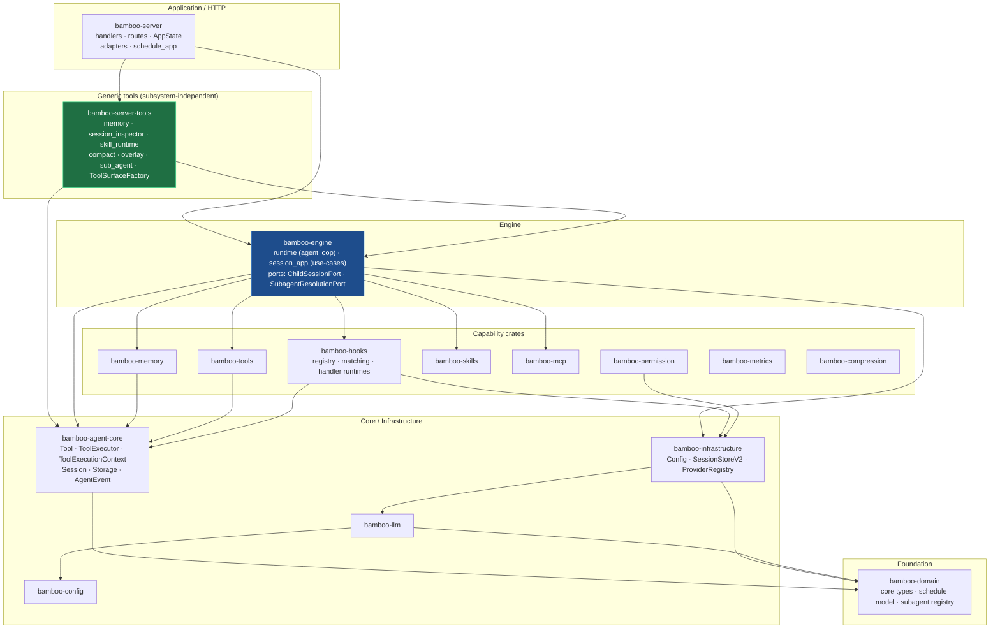
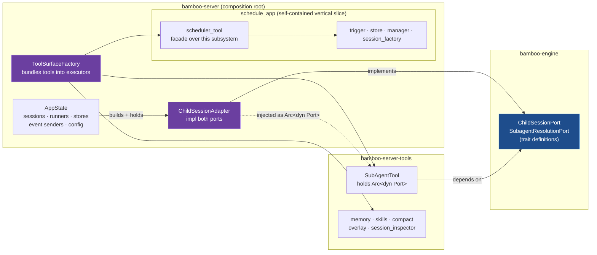

# Bamboo crate 架构

分层的 Cargo workspace。依赖只**向下**指向——没有环。HTTP 服务器是薄薄的最上层；agent 循环与用例位于 `bamboo-engine`；port 通过依赖倒置连接通用工具与服务器的 `AppState`。

## 1. crate 依赖分层

- **`bamboo-server-tools`**（绿色）——在 L1 中抽出。存放属于通用 agent 能力的工具。只依赖下层的 crate，绝不依赖 `bamboo-server`/`AppState`。
- **`bamboo-engine`**（蓝色）——拥有 agent 循环**以及**让通用工具在不依赖服务器的前提下访问服务器运行时状态的 port trait。
- **`bamboo-hooks`**——负责生命周期注册、匹配器求值、确定性分发、命令执行以及外部脚本运行时的选择。引擎拥有生命周期缝合点，并应用其返回的控制或上下文效果。

## 2. port 模式（依赖倒置）

展示一个通用工具（`SubAgentTool`）如何在不依赖 `bamboo-server` 的情况下访问绑定于 `AppState` 的运行时状态，以及调度工具为何留在自己的子系统内。

**解读：**

- 依赖边 `SubAgentTool → AppState` 已消失。现在指向 `SubAgentTool → Port`（engine）和 `Adapter → Port`（server）。箭头被*倒置*了：工具与服务器都依赖引擎拥有的 trait。
- `ChildSessionAdapter`（紫色）是唯一绑定 `AppState` 运行时状态的地方。它实现了 `ChildSessionPort`（session 生命周期：加载/保存/运行/取消 + 等待父级 + 活跃子级）和 `SubagentResolutionPort`（subagent_type → 模型/元数据/prompt）。
- `ToolSurfaceFactory` 是组合根，负责组装 agent 运行时使用的各表面工具执行器（Base / Child / WithTask / Root）。
- **`scheduler_tool`** 留在 `schedule_app` *内部*：它是该子系统的门面（其参数内嵌调度领域类型；返回调度 DTO），而不是一个与子系统无关的能力。让它与子系统同址保留了内聚性，也使 `schedule_app` 成为一个随时可以独立成 crate 的干净切片。

## 3. L1 改变了什么

| | 之前 | 之后 |
|---|---|---|
| 通用工具（memory、skills、compact、overlay、session_inspector） | `bamboo-server::server_tools` | `bamboo-server-tools` crate |
| `SubAgentTool` | 持有具体的 `Arc<ChildSessionAdapter>` | 持有 `Arc<dyn ChildSessionPort>` + `Arc<dyn SubagentResolutionPort>`；位于 `bamboo-server-tools` |
| port | 无 | `bamboo-engine` 中的 `ChildSessionPort`（已扩展）+ `SubagentResolutionPort` |
| 调度工具 | `bamboo-server::tools::schedule_tasks` | `bamboo-server::schedule_app::scheduler_tool`（连同其子系统） |
| `bamboo-server/src` | 49,465 LOC | 45,488 LOC |

这一步为后续迁移铺路：**L2** 把 handler 编排下沉到 `engine::session_app` 用例；**L5** 把整个 `schedule_app` 切片（包括其工具）上提为独立的 `bamboo-schedule` crate。
