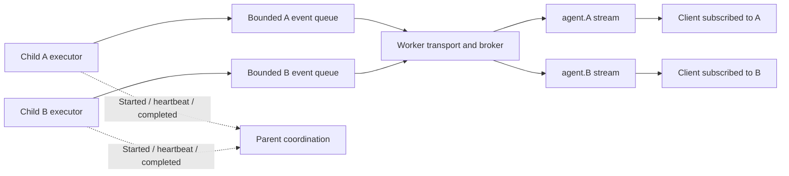

# Session 与 subagent 并发

运行时为每个子 agent 提供独立的事件流和有界生产者队列。父级接收语义化的子 agent 生命周期事件，不转发子 agent 的 token 流。本文档涵盖进程内协调与资源生命周期——即使在递归 token 转发被移除之后，这些内容依然重要。

## 边界

| 路径 | 协调方式 | 原因 |
| --- | --- | --- |
| Session 缓存查找/发布 | 无锁跳表索引与原子不可变快照 | 读取者或长时间的会话记录克隆不得阻塞另一个 session 或其写入者。 |
| 窄范围缓存元数据补丁 | 用 compare-and-swap 重试纯补丁 | 保留其他写入者的发布，而不是覆盖一个已脱离的旧快照。 |
| 实时 token 发布 | 每次运行的原子准入围栏与活动时钟 | token 流量不获取进程级 runner 注册表。 |
| Runner 替换与可重放状态 | 既有的生命周期注册表协调 | 在后继者发布 Started 之前排空已准入的旧帧；保持快照/实时重放顺序。 |
| 持久化 session 提交 | 既有的每 session 与跨进程事务锁 | 保持文件系统原子性、任务世代与恢复 journal。这些不宣称是无锁存储。 |
| Worker 事件生产 | 有界异步队列 | 缓慢的下游传输施加反压，而不是无限制地保留 JSON 事件。 |
| 空闲 session 逐出 | 精确通道身份、外部订阅者与生产者所有权 | 内部通知中继不得阻碍自身的回收；活跃客户端与子生产者仍受保护。 |

## Session 快照

`SessionCache::default()` 创建共享缓存。`SessionSnapshot::new(session)` 创建一个不可变的已发布版本。`read()` 返回稳定视图，`read().clone()` 保持既有的分离式 `Session` 契约。

活跃的缓存条目在逐出之前保持稳定的槽位。发布完整快照会原子地更新该槽位。窄范围的 `update` 会针对最新槽位值重试，因此在其他写入者发布替换版本时，它无法成功修补一个已被孤立的版本。更新闭包不得有外部副作用。持久化 I/O 仍留在 `SessionRepository` 中，位于这些重试闭包之外。

快照写入会复制 session 值，这是有意用写时复制换取读取者的独立性。token 事件不会修改 session 快照；大的会话记录复制不得移入 token 路径。

## 独立事件投递

每次运行持有一个 `EventPublication` 围栏。同步 token 发布先获取原子许可。替换或移除 runner 时会关闭准入并等待已准入的发送完成，然后才暴露后继者。这能防止后继者的 Started 事件之后出现迟到的旧 token，同时不为该 token 获取任何全局 runner 锁。关键重放状态仍使用既有的缓存加广播事务。子 agent 的活动时钟包含这些原子 token 发布，因此繁忙的流不会被其 watchdog 误判为停滞的 worker。

这是应用层的协调保证。Tokio 通道、网络、分配器、磁盘持久化与操作系统进程各有自己的同步机制，本文不宣称它们普遍无锁。

## 资源所有权

通知观察者用弱发送者注册其精确通道。其 RAII 订阅会在丢弃接收者之前注销，任务取消时亦然。旧的通道世代无法清除新中继的注册。空闲逐出只忽略匹配的内部接收者，并保留外部接收者与未完成的生产者句柄。配对的 runner、事件发送者与缓存的会话记录会一起回收；持久化的 session 历史仍可供后续加载。

每 session 的持久化锁注册表也会在等待互斥锁之前布置好清理。在前一个等待者释放锁之后取消最后一个等待者，不得为每个历史子 agent session 留下一个条目。父级唤醒串行化同样会租用其注册表条目：最后一个持有者完成或取消时移除该条目，同时保持并发唤醒的串行化。

Worker 连接任务拥有其执行任务与辅助任务。断开与替换会取消执行，允许有界的协作式关闭，然后中止并 join 其余任务。关联等待者与运行注册都有 RAII 清理，执行器 panic 会变成终态错误，而不是留下一条背后已无任务的在途记录。CLI 进程所有权也能在优雅退出 future 被取消后存活：在 Unix 上，Drop 会杀死所拥有的进程组及被跟踪的后代进程。活跃的 app-server 连接属于那次运行，只有在一个完整回合结束且辅助任务清理完毕后才回到热槽位；被中止的运行不能让上一个回合留在可复用的连接里。

## 验证契约

- 在持有全局 runner 写守卫的情况下，让 512 个独立的子 agent 流投递 32,768 个 token 事件；每个流都必须取得进展并记录活动。
- 在发布期间保留一个旧的 session 读取；在新版本可读的同时它保持一致。并发窄范围补丁须保留全部 512 个键。
- 在窄范围补丁的首次读取与 CAS 之间强制一次完整发布；补丁重试后同时保留新快照与补丁。
- 退役一个带有已准入发布的运行；替换会等待该帧完成，并拒绝新的旧世代帧。
- 取消 512 个 session ID 的最后一个等待者，并验证持久化锁映射与等待计数器都回到基线。
- 为 512 个已终结的子 agent 运行真实的通知中继，并验证空闲清理会回收其运行时资源，同时保留已订阅/运行中的 session。
- 填满 worker 的有界事件队列；生产者等待接收者容量恢复，取消/断开不会留下游离的执行或关联等待者。
- 通过 WebSocket Cancel 与服务端属主中止运行真实的 Unix CLI 桩；leader 与孙进程都会消失。中止之后，app-server 建立新连接，并能在一次健康完成的回合之后复用它。
- 仅回复式的 Ask/Task 执行可以产出超过一个队列容量的事件并仍返回其答案；有意不使用的事件接收者会被关闭。

这些确定性夹具能在不启动数百个付费模型请求或 OS worker 进程的情况下演练数百个 session。物理 worker 容量与 provider/网络配额仍是独立的部署限制。
